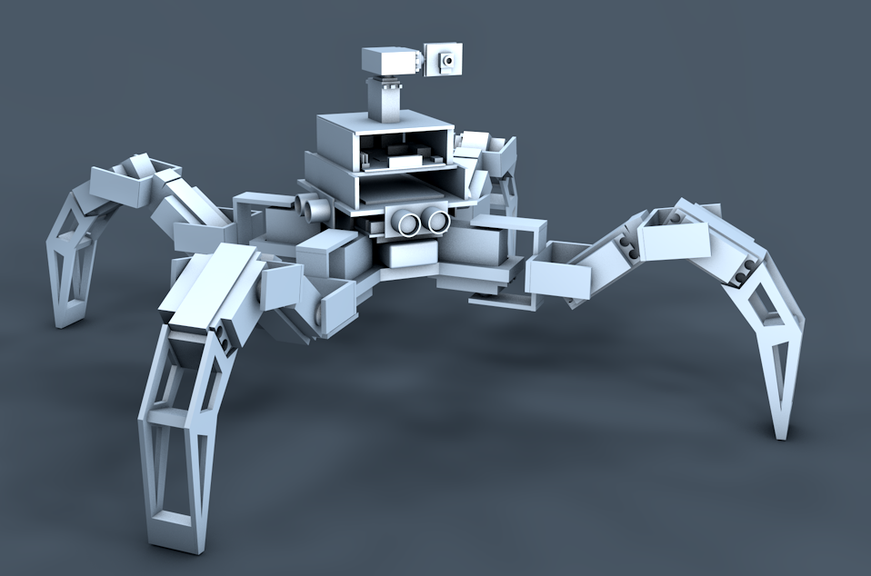

# Quadruped

Robot cuadrúpedo hecho con arduino y rasperry pi. Entre los dispositivos utilizados se encuentran:
- Motores Servo y paso a paso
- Sensores Ultrasonido HC-SRO4
- Camara raspberry NoIR
-
-

